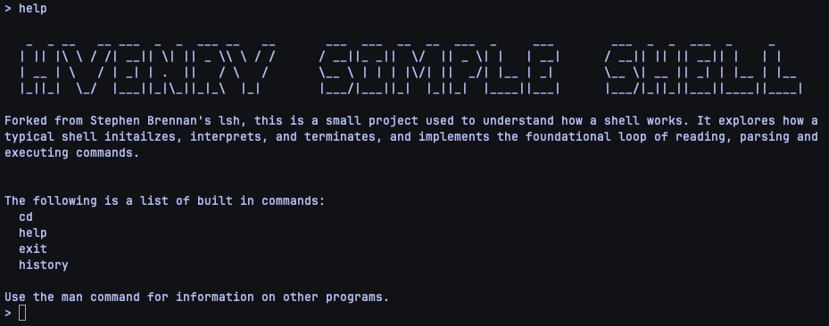

# Simple C Shell

A minimal Unix shell in C, built to learn how a shell reads, parses, and executes commands.



## Features

- Read-parse-execute loop with a `> ` prompt
- Runs any program on `PATH` via `fork`, `execvp`, and `waitpid`
- Builtins: `cd`, `help`, `exit`, and `history` (last 100 commands)
- Small enough to read in one sitting, based on Stephen Brennan's [Write a Shell in C](https://brennan.io/2015/01/16/write-a-shell-in-c/)

## Quick start

Needs a C compiler and Linux or macOS.

```bash
git clone git@github.com:hvenry/simple-c-shell.git
cd simple-c-shell
make
./simple_shell
```

Type `help` for the builtins and `exit` to quit.

## Docs

- [Command loop](docs/command-loop.md) - how a line becomes a builtin call or a child process, and current limits
- [Builtins](docs/builtins.md) - what each builtin does and how to add one
