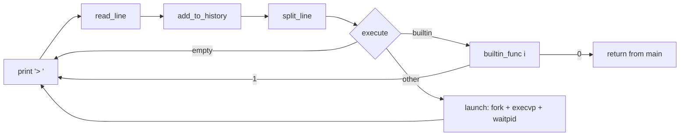

# Command loop

The read-parse-execute loop that turns a line of input into a builtin call or a child process.

## Why
This is the whole shell: without it there is no prompt, no parsing, and no way to run programs.
Keeping each stage in its own function makes it possible to test and extend one stage (for example, a real tokenizer) without touching the others.

## How it works
`main` calls `simple_shell_loop`, which repeats until a builtin returns 0.

1. **Read.** `simple_shell_read_line` reads chars with `getchar` into a heap buffer that grows in 1024-byte steps, stopping at newline or EOF.
2. **Parse.** `simple_shell_split_line` splits the line in place with `strtok` on space, tab, CR, LF, and BEL, into a NULL-terminated `char **` that grows in 64-pointer steps.
3. **Execute.** `simple_shell_execute` returns 1 for an empty line, runs a matching builtin, or falls through to `simple_shell_launch`.
4. **Launch.** The child calls `execvp(args[0], args)`, which searches `PATH`; on failure it prints via `perror` and exits with `EXIT_FAILURE`.
   The parent loops on `waitpid(..., WUNTRACED)` until the child has exited or been killed by a signal.
5. The loop frees the line and the token array (tokens point into the line, so they are not freed individually).

## Tech
- POSIX `fork`, `execvp`, `waitpid` from `<unistd.h>` and `<sys/wait.h>`.
- libc `strtok`, `malloc`, `realloc`.

## Key files
- `simple_shell.c` - all four stages plus `main`.
- `builtins/builtin.h` - the dispatch table the execute stage consults.

## Decisions and gotchas
- **EOF never exits.** `read_line` returns an empty string on EOF, so piped input or Ctrl-D loops forever printing `> `. Non-interactive runs must end with `exit`.
- **No quoting, pipes, redirection, globbing, or variable expansion.** Tokens are whitespace-separated words; `echo "a b"` passes `"a` and `b"`.
- **No signal handling.** Ctrl-C reaches the shell itself and kills it, not just the child.
- **Stopped children hang the prompt.** `WUNTRACED` reports a stopped child (Ctrl-Z), but the wait loop only ends on exit or signal death, so it keeps waiting.
- **Exit status is discarded.** Child status is never stored, so there is no `$?`.
- **Every line goes into history, including blank ones,** because history is recorded before the empty check.
- `getchar` is used instead of `getline` to show manual buffer growth; `getline` would be shorter and is the obvious swap.

## Related
- [Builtins](builtins.md)
